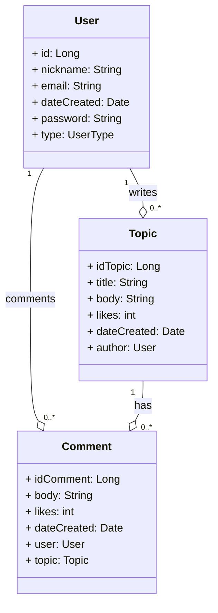

# Read Me First
The following was discovered as part of building this project:

* The original package name 'com.franca.blog-gamer-api' is invalid and this project uses 'com.franca.bloggamerapi' instead.

# Getting Started

### Reference Documentation
For further reference, please consider the following sections:

* [Official Gradle documentation](https://docs.gradle.org)
* [Spring Boot Gradle Plugin Reference Guide](https://docs.spring.io/spring-boot/docs/2.7.16/gradle-plugin/reference/html/)
* [Create an OCI image](https://docs.spring.io/spring-boot/docs/2.7.16/gradle-plugin/reference/html/#build-image)
* [Spring Web](https://docs.spring.io/spring-boot/docs/2.7.16/reference/htmlsingle/index.html#web)
* [Spring Data JPA](https://docs.spring.io/spring-boot/docs/2.7.16/reference/htmlsingle/index.html#data.sql.jpa-and-spring-data)
* [OpenFeign](https://docs.spring.io/spring-cloud-openfeign/docs/current/reference/html/)

### Guides
The following guides illustrate how to use some features concretely:

* [Building a RESTful Web Service](https://spring.io/guides/gs/rest-service/)
* [Serving Web Content with Spring MVC](https://spring.io/guides/gs/serving-web-content/)
* [Building REST services with Spring](https://spring.io/guides/tutorials/rest/)
* [Accessing Data with JPA](https://spring.io/guides/gs/accessing-data-jpa/)

### Additional Links
These additional references should also help you:

* [Gradle Build Scans – insights for your project's build](https://scans.gradle.com#gradle)
* [Declarative REST calls with Spring Cloud OpenFeign sample](https://github.com/spring-cloud-samples/feign-eureka)

# blog-gamer-api

## Class Diagram:

Public link: [blog-gamer-api](https://blog-gamer-api-prd.up.railway.app/)
Swagger link: [swagger-ui.html](https://blog-gamer-api-prd.up.railway.app/swagger-ui/index.html)
